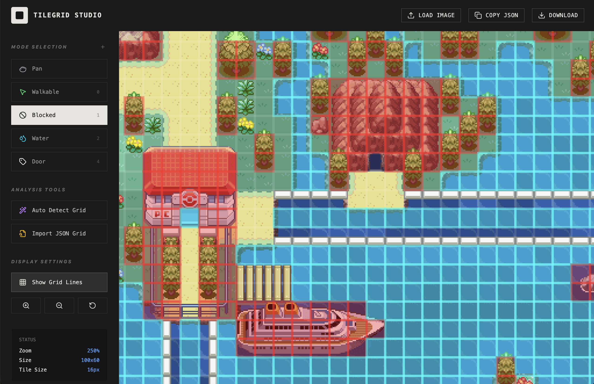

# TileGrid Studio

TileGrid Studio is a tool designed for mapping out grids used in 2D game development. It allows developers to import image assets and paint collision, terrain, or custom metadata labels onto a pixel-perfect grid.

## Overview

In 2D game development, managing tile-based data (like which tiles are walkable, water, or triggers) can be tedious. TileGrid Studio simplifies this workflow by providing an intuitive canvas interface where you can "paint" your game data directly onto your textures.

## Key Features

- **Pixel-Perfect Grid Mapping**: Map data at a standard 16px tile size with pixel-art rendering support.
- **Custom Metadata Labels**: Create custom labels with unique IDs and colors (e.g., Doors, Triggers, Spawn Points).
- **Auto-Detection**: Use heuristic analysis to automatically detect water, obstacles, and walkable paths from your images.
- **Advanced Navigation**: Smooth panning and zooming (up to 4x) for precise mapping of large assets.
- **JSON Export/Import**: Seamlessly integrate with your game engine. Export your grid as a clean JSON structure or copy it directly to your clipboard.
- **Persistence**: Your custom label configurations are saved locally, ensuring you don't lose your setup between sessions.
- **Continuous Painting**: Click and drag to fill regions quickly and efficiently.

## Technical Details

- **Built with**: React 18, Vite, and TypeScript.
- **Styling**: Tailwind CSS for a professional dark-themed UI.
- **Icons**: Lucide React.
- **Animations**: Framer Motion.

## Getting Started

1. **Load Image**: Upload your game textures or tilemaps.
2. **Select Mode**: Choose a label type (Walkable, Blocked, etc.) or create a new custom label.
3. **Paint**: Click or drag on the canvas to assign metadata to tiles.
4. **Export**: Copy the JSON or download it to use in your game engine.

---

*This tool was built to bridge the gap between visual asset creation and structural game data.*
